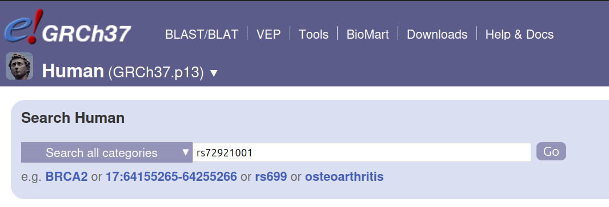
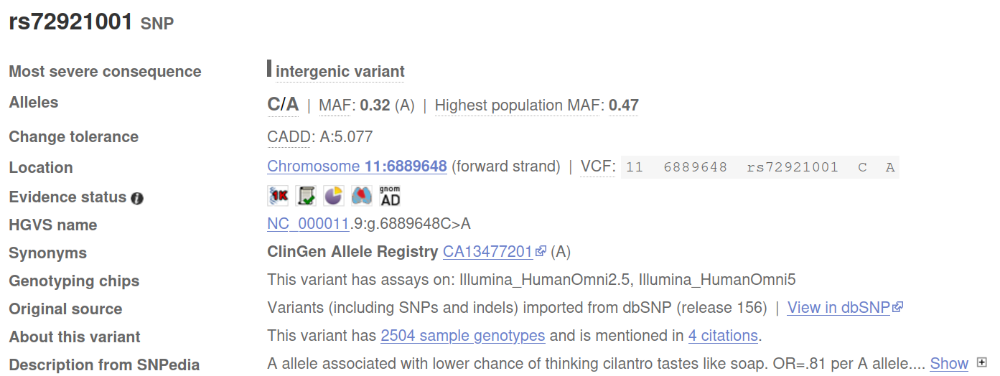
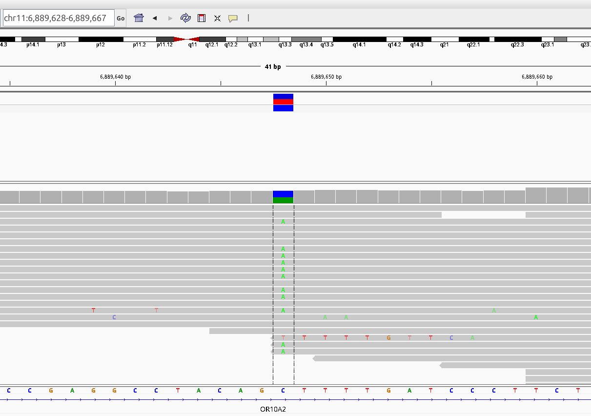

# personal-genome

Scripts and notebooks I used to analyze my own genome sequence.

## Set up

I use a laptop with 16G RAM and Ubuntu operating system.

Here are the tools that we will be using:
- [IGV genome browser](https://igv.org/) - for visualization
 - [samtools](https://www.htslib.org/) - for processing genome alignment (BAM) files
 - [bcftools](https://samtools.github.io/bcftools/bcftools.html) - for manipulating variant call format (VCF) files

I prefer to use Docker images for most of the tools, if such an image exists.

## Data

I sequenced my genome with Dante labs *(disclaimer: I am neither advertising nor getting anything from them)* for two reasons:

- attractive price (250$ for 30x coverage in 2024)
- they deliver all the raw data

I came to the idea thanks to this [highly recommended blogpost from my friend German](https://medium.com/@german.m.demidov/how-to-analyse-your-own-dna-a-point-of-view-of-ordinary-customer-part-i-226284ba9466).

Here are the file types that they deliver:

File | Description
--- | ---
GFX0000000_SA_L001_R1_001.fastq.gz | read1 (raw)
GFX0000000_SA_L001_R2_001.fastq.gz | read2 (raw)
GFX0000000.bam | reads aligned to reference genome (hg19)
GFX0000000.bam.bai | index file for aligned reads
GFX0000000.filtered.snp.vcf.gz | variants: single nucleotide polymorphisms (SNP)
GFX0000000.filtered.snp.vcf.gz.tbi | index file for SNP
GFX0000000.filtered.indel.vcf.gz | variants: insertions and deletions
GFX0000000.filtered.indel.vcf.gz.tbi | index file for indels
GFX0000000.cnv.vcf.gz | variants: copy number variants (CNV)
GFX0000000.cnv.vcf.gz.tbi | index file for CNV


**Important:** make sure to download all the files and keep them backed up. Dante labs will remove them after a few months.

## Looking at your genome

I prefer [IGV genome browser](https://igv.org/doc/desktop/) to look at the genomic data.

- Download IGV according to your system and load your data according to the [manual](https://igv.org/doc/desktop/#QuickStart/):
  - Choose reference genome. In my case it is Human (GRCh37/hg19). ([see below](#how-to-find-the-reference-genome))
  - Important: Go to View -> Preferences -> Alignments and click "Downsample reads" (I use 100 reads per window of 50 bases), otherwise IGV will be slow on a laptop.
  - Go to File -> Load from file and select your bam and/or vcf file. For example, I loaded bam and SNP vcf.

---
#### How to find the reference genome

Dante labs may have update their reference to a newer one, hg38. We can use samtools to look at the header of the BAM alignment file, which stores the full command which have been used to process the data, including path to the reference. 

```
samtools view -H GFX0000000.bam | grep --color ht-reference
```
In the output, we can see "v37" or "grch37" after the "--ht-reference" parameter:

```
@PG	ID: Hash Table Build	VN: 01.003.044.3.4.11-hv-7	CL: dragen --build-hash-table true --ht-reference /staging/human_g1k_v37_decoy.fasta --output-directory /staging/grch37/ --enable-cnv true --enable-rna true	DS: digest_type: 1 digest: 0xF2543D4A ref_digest: 0xC2311E75 ref_index_digest: 0xB4307AF0 hash_digest: 0x7BF2A3E5
```

This means that the reference genome is Human (GRCh37/hg19). If you see "v38", choose Human (hg38). Other references, such as T2T, are also possible.

---

Let us look at one specific variant. For example, we can google for "cilantro taste SNP" to find out if I like or hate cilantro taste. Each SNP has an id, and this one's id is rs72921001. We can enter this into the search field of the IGV and the browser will center on it. Click and drag around the site to zoom in a bit more.

There are several websites where we can get information about a variant. Because our reference genome is a bit older, I prefer to use the [archived version of Ensembl](https://grch37.ensembl.org/Homo_sapiens/Info/Index). 



We can see some information about this variant, such as:
- what is the reference nucleotide (C)
- what is the alternate allele (A)
- what is the frequency of this allele in the population (minor allele frequency, MAF) - this seems to be a very common allele with 0.32
- what is the deleteriousness of this allele (CADD score)
- location in the genome
- links to other databases and publications



Looks like people with A like cilantro and people with C hate it. What about me? I am heterozygous, have both A and C - this can be seen by the two different colors on the vcf file, as well as in raw reads (C's are not spelled out because they are equal to reference, and A's are spelled out in green).



*Note: A single T is probably an error in the sequencing process - this can happen, especially at an end of the read*

Well, I used to hate cilantro as a child and I am crazy about it as an adult. I am not a neuroscientist, but this gene is an olfactory receptor (what OR in the gene name stands for) and it seems that [neurons express them in monoallelic fashion](https://www.ncbi.nlm.nih.gov/pmc/articles/PMC4882762/) - in contrast to usual situation, when both alleles of a gene are active. Could it be that cilantro loving neurons took over as I grew up? Who knows, but I am not unhappy about the fact.

## Annotating variants

We will follow this [helpful resource from Merriman Lab](https://merrimanlab.github.io/post/2021-09-21-vcf-annotation/).

VCF file from Dante labs does not contain SNP IDs (rs...). To add them, we would first need to get them from dbSNP database which is hosted by NCBI.

- Download the dbSNP VCF from this FTP site: https://ftp.ncbi.nih.gov/snp/organisms/human_9606_b151_GRCh37p13/VCF/. Again, make sure that the version of the genome corresponds to the reference that has been used by Dante labs. 

  Since my internet connection at home is slow, I decided to only use common SNPs file, which is 1.5G (all SNPs is 15G and would take too long to download): `00-common_all.vcf.gz`. You will also need the `00-common_all.vcf.gz.tbi` index.

- Use bcftools to annotate your VCF like this:
  ```
  bcftools annotate -a 00-common_all.vcf.gz -c ID -o GFX0000000.filtered.snp.dbsnp_annotated.vcf.gz -O z GFX0000000.filtered.snp.vcf.gz
  ```
  Replace GFX0000000... with your actual VCF file name.
